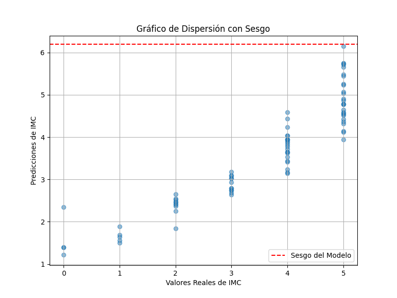
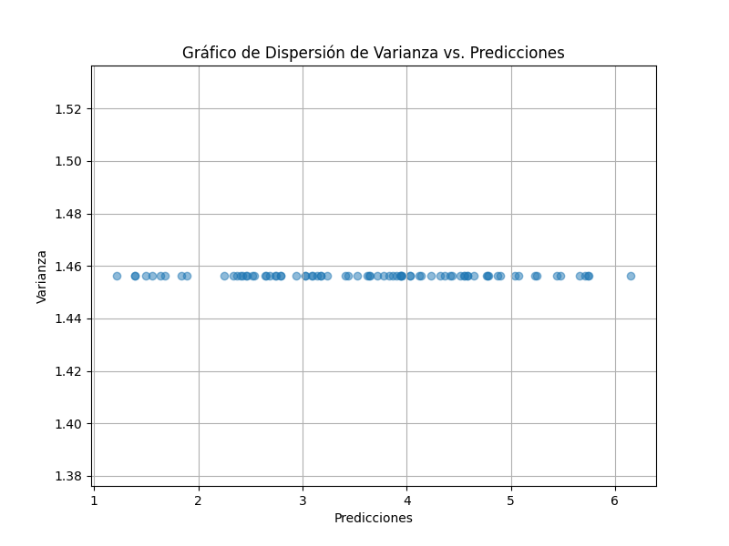
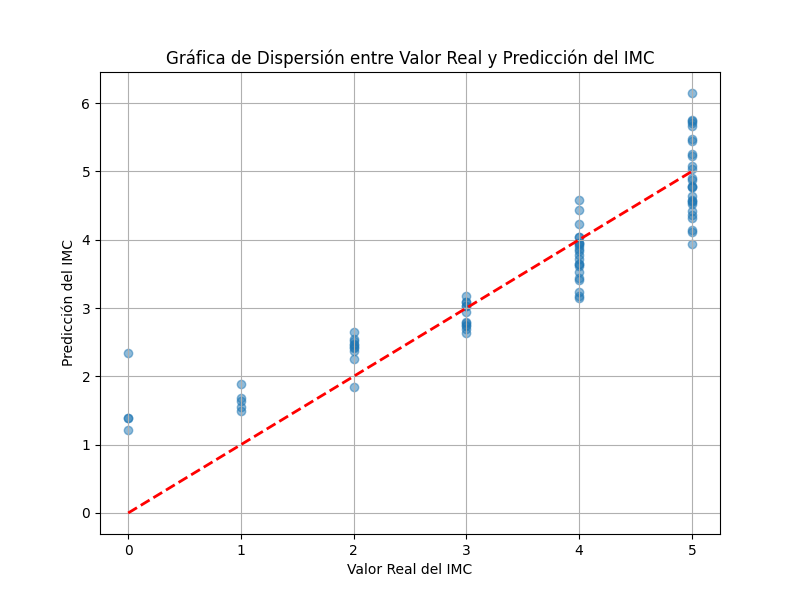

# Análisis de Modelo de Regresión Lineal

## Índice
1. [Introducción](#introducción)
2. [Justificación elección del dataset](#justificación-elección-del-dataset)
3. [Separación de Datos](#separación-de-datos)
4. [Métricas de Evaluación](#métricas-de-evaluación)
5. [Diagnóstico de Sesgo (Bias)](#diagnóstico-de-sesgo-bias)
6. [Diagnóstico de Varianza](#diagnóstico-de-varianza)
7. [Nivel de Ajuste del Modelo](#nivel-de-ajuste-del-modelo)
8. [Recomendaciones](#recomendaciones)
9. [Conclusiones](#conclusiones)
## Introducción
El propósito del siguiente documento es analizar un modelo de regresión lineal creado con la librería de `sci-kit learn`, se expondrá información relacionada al dataset, las métricas usadas para evaluar el modelo, el sesgo que podría estar presente en el modelo y las recomendaciones para tener un mejor modelo de aprendizaje máquina usando regresión lineal.

### Justificación eleccion del data
El dataset elegido resulta apropiado para la aplicación de un algoritmo de regresión lineal debido a varias razones fundamentales. Primero, incorpora características pertinentes, como género, altura y peso, todas las cuales son numéricas y directamente aplicables en un modelo de regresión lineal. Además, la variable objetivo, el índice de masa corporal (IMC), es una variable continua que se ajusta perfectamente al enfoque de regresión lineal. Aunque el tamaño exacto del dataset no se proporciona, parece contener una cantidad razonable de datos, lo que es crucial para entrenar un modelo robusto. La diversidad en las características, que incluye una amplia gama de valores para altura, peso y género, permite al modelo capturar la variabilidad en los datos y generalizar en lugar de simplemente memorizar valores específicos. Además, el enfoque de codificación del género como variable dummy posibilita su uso en el modelo. Para demostrar que el modelo generaliza de manera efectiva, se pueden realizar pasos clave, como la división de datos en conjuntos de entrenamiento y prueba, la validación cruzada, la evaluación en el conjunto de prueba y el análisis de residuos, lo que garantiza una evaluación rigurosa y confiable del rendimiento del modelo.
### Separación de Datos
Antes de realizar de dividir el set de datos, se realizó un preprocesamiento, usando `LabelEncoder` para la columna `Gender`. Condíficandola en ceros y unos para mejorar el entranmiento del modelo. Los datos fueron separados usando la función de scikit-learn `train_test_split`, usando un 80% para el entramiento y un 20% para realizar las pruebas.

```python
X_train, X_test, y_train, y_test = train_test_split(X, y, test_size=0.2, random_state=42)
```
```bash
x_train 
Gender  Height  Weight
  1     153     104
  0     146     104
  0     180     156
  1     183     147
  0     156      52
```
```bash
x_test
Gender  Height  Weight
  0     168      87
  1     182     151
  1     152     103
  0     157      60
  0     187     121
```

## Métricas de Evaluación
### **Mean Squared Error (MSE):**
El Error Cuadrático Medio (MSE) es una métrica que evalúa la calidad de las predicciones de un modelo de regresión al calcular el promedio de las diferencias al cuadrado entre las predicciones del modelo y los valores reales.

En el contexto de este análisis, el MSE cuantifica la magnitud promedio de los errores al cuadrado entre las predicciones del modelo de regresión y los valores reales de IMC. Un MSE más bajo indica que el modelo tiene un mejor ajuste a los datos y que las predicciones se desvían menos de los valores reales. En este caso, el **MSE** al ser de *0.36*, puede interpretarse que los valores de predicción tienen un error poco significativo. 

### **R-squared (R^2):**

El coeficiente de determinación, o R-squared ($R^2$), mide la proporción de la varianza total en los valores de IMC que es explicada por el modelo de regresión. Se calcula como la proporción de la varianza explicada en relación con la varianza total.

En este contexto, un $R^2$ de aproximadamente *0.834* indica que alrededor del *83.4%* de la variabilidad en los valores de IMC se explica mediante el modelo de regresión. Un valor cercano a 1 es deseable, ya que sugiere que el modelo es capaz de explicar una gran parte de la variabilidad en los IMC observados.

### **Mean Absolute Error (MAE):**

El Error Absoluto Medio (MAE) es una métrica que evalúa la precisión de las predicciones del modelo al calcular el promedio de las diferencias absolutas entre las predicciones y los valores reales.

En el contexto de este análisis, el MAE de aproximadamente 0.459 indica que las predicciones del modelo tienen un error absoluto promedio de 0.459 unidades de IMC en comparación con los valores reales. Un MAE más bajo indica una menor discrepancia absoluta entre las predicciones y los valores reales.

## Diagnóstico de Sesgo (Bias)

El sesgo en un modelo de regresión lineal es un término crucial que representa el valor predicho por el modelo cuando todas las características independientes son cero. En nuestro análisis del modelo aplicado al conjunto de datos del Índice de Masa Corporal (IMC), hemos calculado un sesgo de aproximadamente 6.193. Esto significa que, incluso si todas las variables independientes, como altura, peso y género, fueran cero, nuestro modelo pronosticaría un valor de IMC de 6.193 como punto de partida. El sesgo influye en la ubicación vertical de la línea de regresión en nuestros gráficos, lo que afecta directamente nuestras predicciones. Ajustar adecuadamente el sesgo es fundamental para lograr predicciones precisas y un modelo que se adapte eficazmente a los datos reales.



## Diagnóstico de Varianza

La varianza del modelo de regresión lineal aplicado al conjunto de datos del Índice de Masa Corporal (IMC) es de aproximadamente 1.456, lo que indica una dispersión relativamente baja en las predicciones con respecto a la línea de regresión. Esta medida refleja la consistencia y precisión de las estimaciones del IMC generadas por el modelo. En otras palabras, las predicciones tienden a estar cercanas a la línea de mejor ajuste, lo que es un signo positivo de su capacidad de generalización. El gráfico de dispersión creado también respalda esta observación, ya que muestra que la varianza se mantiene en niveles bajos a medida que las predicciones se extienden a lo largo del eje horizontal. En resumen, la baja varianza indica que el modelo logra un equilibrio adecuado entre ajuste y generalización, lo que es esencial para su utilidad en la predicción precisa del IMC.


## Nivel de Ajuste del Modelo
Basado en las métricas de evaluación y la gráfica de dispersión, podemos concluir que el modelo de regresión lineal presenta un buen ajuste a los datos. El **Mean Squared Error (MSE)** de *0.356* y el **Mean Absolute Error (MAE)** de *0.459* son bajos, lo que indica que las predicciones del modelo son cercanas a los valores reales tanto en el conjunto de prueba como en el de validación. Además, el coeficiente de determinación **R-squared** ($R^2$) de *0.834¨* es alto, lo que sugiere que aproximadamente el *83.4%* de la variabilidad en el IMC se explica mediante el modelo. La gráfica de dispersión muestra que las predicciones siguen una línea diagonal, indicando que el modelo se ajusta de manera adecuada. No se observa una brecha significativa entre los puntos de entrenamiento, prueba y validación, lo que sugiere que el modelo no está subajustado (underfitting) ni sobreajustado (overfitting). En resumen, **el modelo está bien ajustado** (fit) y es capaz de generalizar de manera efectiva a datos no vistos, lo que respalda su capacidad predictiva.

## Recomendaciones

- Considera agregar un conjunto de validación para ajustar hiperparámetros y evaluar el modelo en una configuración más parecida a la del mundo real.

- Realiza validación cruzada para evaluar la robustez del modelo en diferentes particiones de datos.

- Realiza análisis de residuos para identificar patrones sistemáticos de error en las predicciones.

- Si es necesario, considera modelos más complejos (no lineales) si el R^2 no es lo suficientemente alto o si los errores son sistemáticos.


## Conclusiones