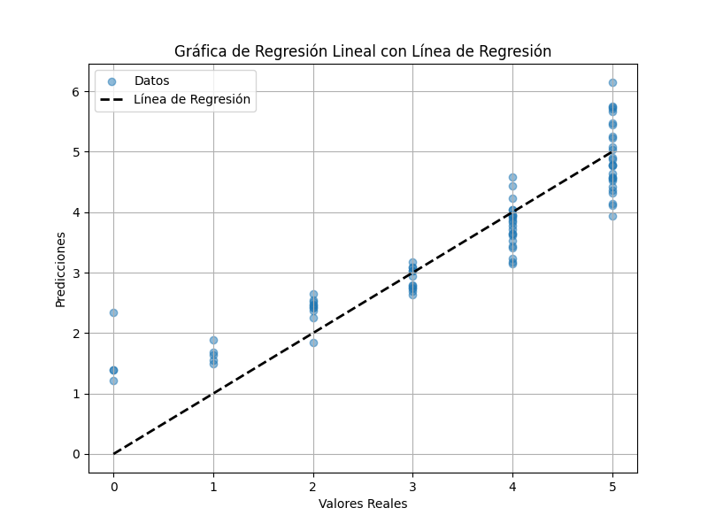

# Análisis de Modelo de Regresión Lineal

### Separación de Datos

- Conjunto de Entrenamiento (Train): Utilizado para entrenar el modelo.
- Conjunto de Prueba (Test): Utilizado para evaluar el rendimiento general del modelo.
- Conjunto de Validación (Validation): No se ha implementado un conjunto de validación, pero se recomienda para ajustar hiperparámetros y prevenir el sobreajuste. Puede crearse dividiendo aún más el conjunto de entrenamiento.

### Métricas de Evaluación

- **Mean Squared Error (MSE):** 0.35626655313488403
  - Un MSE más bajo es mejor, mide el promedio de los errores al cuadrado entre las predicciones y los valores reales.

- **R-squared (R^2):** 0.8341017214738607
  - Un valor cercano a 1 es deseable, indica cuánta varianza en los datos de respuesta está explicada por el modelo.

- **Mean Absolute Error (MAE):** 0.459441534979837
  - Un MAE más bajo es mejor, mide el promedio de los errores absolutos entre las predicciones y los valores reales.

  #### Gráfica de regresión
  

## Diagnóstico de Sesgo (Bias)

- El R-squared (R^2) es relativamente alto (0.8341), lo que sugiere que el modelo no tiene un sesgo muy alto hacia arriba o hacia abajo en las predicciones.

## Diagnóstico de Varianza

- El MSE y el MAE son valores moderadamente bajos, lo que sugiere que el modelo no tiene una varianza extremadamente alta.

## Nivel de Ajuste del Modelo

- Dado que el R^2 es alto y el MSE/MAE son moderadamente bajos, parece que el modelo está bien ajustado a los datos de prueba utilizados. Sin embargo, es importante considerar cómo se comporta con nuevos datos.

## Recomendaciones

- Considera agregar un conjunto de validación para ajustar hiperparámetros y evaluar el modelo en una configuración más parecida a la del mundo real.

- Realiza validación cruzada para evaluar la robustez del modelo en diferentes particiones de datos.

- Realiza análisis de residuos para identificar patrones sistemáticos de error en las predicciones.

- Si es necesario, considera modelos más complejos (no lineales) si el R^2 no es lo suficientemente alto o si los errores son sistemáticos.
